<!-- 🎬 Theme-Aware Animated macOS Terminal Hero Banner -->
<p align="center">
  <picture>
    <source media="(prefers-color-scheme: dark)" srcset="dark.svg">
    <source media="(prefers-color-scheme: light)" srcset="light.svg">
    
  </picture>
</p>

<!-- 🌐 Quick Social & Connect Badges -->
<p align="center">
  <a href="mailto:vandanarora18@gmail.com">
    
  </a>
  <a href="https://linkedin.com/in/vandan-arora-ba348525b/">
    
  </a>
  <a href="https://github.com/VandanArora18">
    
  </a>
</p>

<br/>

<!-- 🧠 About Me & Engineering Focus -->
## 👨‍💻 About Me

```sys-info
  Identity    : Vandan Arora
  Degree      : B.E. Robotics & Artificial Intelligence
  Institute   : Thapar Institute of Engineering and Technology
  Focus       : Autonomous Systems, Computer Vision, Edge AI, Mobile Security
  Current Status : 🟢 Open for AI/ML & Robotics Internships / Projects
```

- 🤖 **Passionate about Robotics & AI**: Building intelligent systems that combine real-time computer vision, deep learning, and hardware automation.
- ⚡ **Core Engineering**: Developing robust backends with **Python & FastAPI**, mobile applications with **Flutter**, and edge AI algorithms with **OpenCV & PyTorch**.
- 🔐 **Featured Work**: Built **Carrier Lock System** for mobile device carrier security and **AdmitOne** smart ticketing application.
- 🎯 **Goals**: Designing next-gen autonomous robotic systems and high-throughput computer vision pipelines.

<br/>

<!-- 🚀 Tech Stack Grid -->
## 🛠️ Tech Stack & Skillset

<table align="center" width="100%">
  <tr>
    <td width="25%" valign="top">
      <h3 align="center">Languages</h3>
      <p align="center">
        <br/>
        <br/>
        <br/>
        
      </p>
    </td>
    <td width="25%" valign="top">
      <h3 align="center">AI & Computer Vision</h3>
      <p align="center">
        <br/>
        <br/>
        <br/>
        
      </p>
    </td>
    <td width="25%" valign="top">
      <h3 align="center">Frameworks & Mobile</h3>
      <p align="center">
        <br/>
        <br/>
        <br/>
        
      </p>
    </td>
    <td width="25%" valign="top">
      <h3 align="center">Tools & Infrastructure</h3>
      <p align="center">
        <br/>
        <br/>
        <br/>
        
      </p>
    </td>
  </tr>
</table>

<br/>

<!-- 📊 Self-Hosted GitHub Statistics & Streak -->
## 📊 GitHub Analytics

<p align="center">
  <!-- Streak Counter -->
  <picture>
    <source media="(prefers-color-scheme: dark)" srcset="https://streak-stats.demolab.com/?user=VandanArora18&theme=dark&background=070C18&border=38BDF8&stroke=38BDF8&currStreakNum=38BDF8&sideNums=38BDF8&sideTitle=F8FAFC&dates=94A3B8" />
    <source media="(prefers-color-scheme: light)" srcset="https://streak-stats.demolab.com/?user=VandanArora18&theme=default&background=FFFFFF&border=0284C7&stroke=0284C7" />
    
  </picture>
</p>

<p align="center">
  <!-- GitHub Stats Card (Self-Hosted Vercel Instance) -->
  <picture>
    <source media="(prefers-color-scheme: dark)" srcset="https://github-readme-stats-acme-6240.vercel.app/api?username=VandanArora18&show_icons=true&theme=dark&bg_color=070C18&title_color=38BDF8&text_color=F8FAFC&icon_color=38BDF8&border_color=38BDF8&hide_border=false" />
    <source media="(prefers-color-scheme: light)" srcset="https://github-readme-stats-acme-6240.vercel.app/api?username=VandanArora18&show_icons=true&theme=default&bg_color=FFFFFF&title_color=0284C7&text_color=0F172A&icon_color=0284C7&border_color=0284C7&hide_border=false" />
    
  </picture>
  &nbsp;
  <!-- Top Languages Card (Self-Hosted Vercel Instance) -->
  <picture>
    <source media="(prefers-color-scheme: dark)" srcset="https://github-readme-stats-acme-6240.vercel.app/api/top-langs/?username=VandanArora18&layout=compact&theme=dark&bg_color=070C18&title_color=A78BFA&text_color=F8FAFC&icon_color=A78BFA&border_color=A78BFA&hide_border=false" />
    <source media="(prefers-color-scheme: light)" srcset="https://github-readme-stats-acme-6240.vercel.app/api/top-langs/?username=VandanArora18&layout=compact&theme=default&bg_color=FFFFFF&title_color=6D28D9&text_color=0F172A&icon_color=6D28D9&border_color=6D28D9&hide_border=false" />
    
  </picture>
</p>

<br/>

<!-- 🐍 Contribution Snake Animation -->
## 🐍 Contribution Activity

<p align="center">
  <picture>
    <source media="(prefers-color-scheme: dark)" srcset="https://raw.githubusercontent.com/VandanArora18/VandanArora18/output/snake-dark.svg" />
    <source media="(prefers-color-scheme: light)" srcset="https://raw.githubusercontent.com/VandanArora18/VandanArora18/output/snake-light.svg" />
    
  </picture>
</p>
